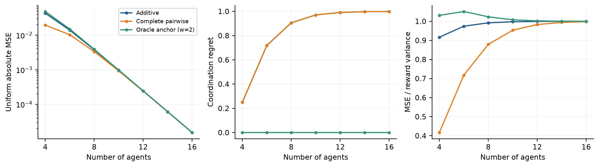

# Local Credit Diagnostics

A reproducible research-oriented diagnostic study of **reward reconstruction error versus cooperative decision quality**.

The project investigates whether a low numerical error in a reward decomposition necessarily implies that the decomposition preserves useful decisions.

## Research question

Can reward reconstruction error be a reliable proxy for downstream cooperative decision quality?

The study separates two quantities that can otherwise be conflated:

1. how closely a decomposition reconstructs the reward function; and
2. whether the reconstructed reward selects a high-quality joint action.

## Methodology

- Defines fully enumerable synthetic cooperative games.
- Studies additive and interaction-based feature spaces, including chain, ring, star, and complete interaction structures.
- Computes exact population projections and finite-sample least-squares fits.
- Measures MSE, normalized MSE, range-normalized error, regret, selected action, and decision success.
- Varies agent count, reward-synergy strength, interaction structure, and finite-sample coverage.
- Includes controls and an attributed published payoff matrix as a sanity check.
- Records configuration hashes, source hashes, seeds, generated results, figures, and verification artifacts.

## Experiments / Evaluation

The executed study contains **96 exact evaluations and 800 finite-coverage fits**, together with control experiments.

The finite-sample unit is an independently generated training dataset. Training and exhaustive evaluation actions may overlap intentionally because the study concerns projection and coverage rather than unseen-task generalization.

The repository includes tests that compare analytical formulas and projection calculations against least-squares solutions.

## Results / Findings

For the 16-agent sparse-synergy setting, the additive projection produces:

- **MSE:** 0.0000152548
- **Coordination regret:** 0.999268
- **MSE / reward variance:** 0.999939

Thus, a very small raw reconstruction error can coexist with poor cooperative decision quality.

Adding pairwise factors reduces reconstruction error in the reported setting, while the maximizing action remains unchanged. This provides a controlled example of why downstream decision metrics should accompany reconstruction metrics when studying reward decomposition.

## Reproducibility

The repository contains executable experiment and analysis scripts, frozen configurations and protocol documentation, raw exact and sampling results, generated figures and tables, verification scripts and tests, and a manuscript draft describing the study.

A full run can be reproduced without a GPU, model API, or external data download.

## Scope and limitations

This is a synthetic diagnostic study rather than a neural MARL benchmark. It does not establish how the observed relationship transfers to large sequential environments or to learned reward-decomposition systems.

## Academic context

The project is presented as research-oriented work focused on controlled computational experimentation and evaluation of cooperative decision-making methods.
